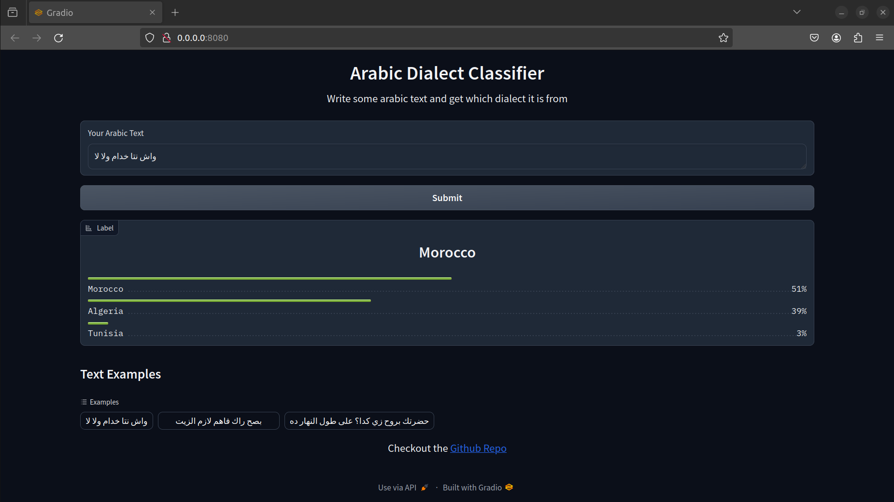

# Arabic Dialect Classifier
This project is a classifier of arabic dialects at a country level:  
Given some arabic text, the goal is to predict the country of the text's dialect.  
  
App Demo:  
https://cc5e7feb4f4d2f1460.gradio.live/
  

## Run the app locally with Docker:
1. Clone the repository with Git:  
```
git clone https://github.com/zaidmehdi/arabic-dialect-classifier.git
```
2. Build the Docker image:  
```
sudo docker build -t adc .
```
3. Run the Docker Container:
```
sudo docker run -p 8080:8080 adc
```
  
Now you can access the demo locally at:
```
http://localhost:8080
```

## How I built this project:
The data used to train the classifier comes from the NADI 2021 dataset for Arabic Dialect Identification [(Abdul-Mageed et al., 2021)](#cite-mageed-2021).  
It is a corpus of tweets collected using Twitter's API and labeled thanks to the users' locations with the country and region.  

I used the language model `https://huggingface.co/moussaKam/AraBART` to extract features from the input text by taking the output of its last hidden layer. I used these vector embeddings as the input for a Multinomial Logistic Regression to classify the input text into one of the 21 dialects (Countries).

For more details, you can refer to the docs directory.

## References:
- <a name="cite-mageed-2021"></a>
[Abdul-Mageed et al., 2021](https://arxiv.org/abs/2103.08466)  
*Title:* NADI 2021: The Second Nuanced Arabic Dialect Identification Shared Task  
*Authors:* Abdul-Mageed, Muhammad; Zhang, Chiyu; Elmadany, AbdelRahim; Bouamor, Houda; Habash, Nizar  
*Year:* 2021  
*Conference/Book Title:* Proceedings of the Sixth Arabic Natural Language Processing Workshop (WANLP 2021)
