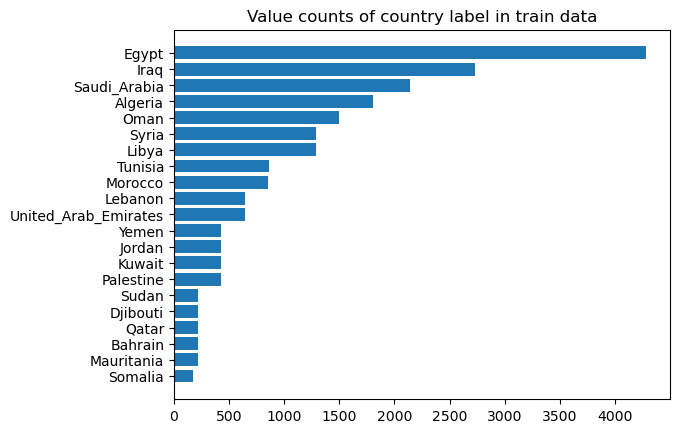
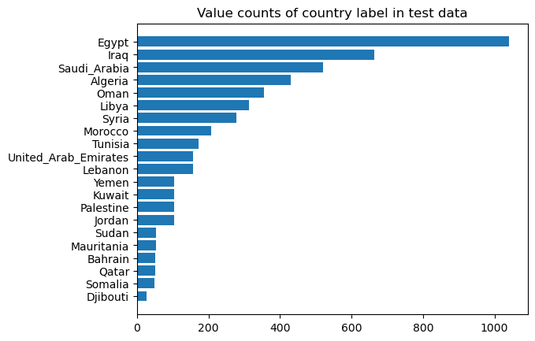
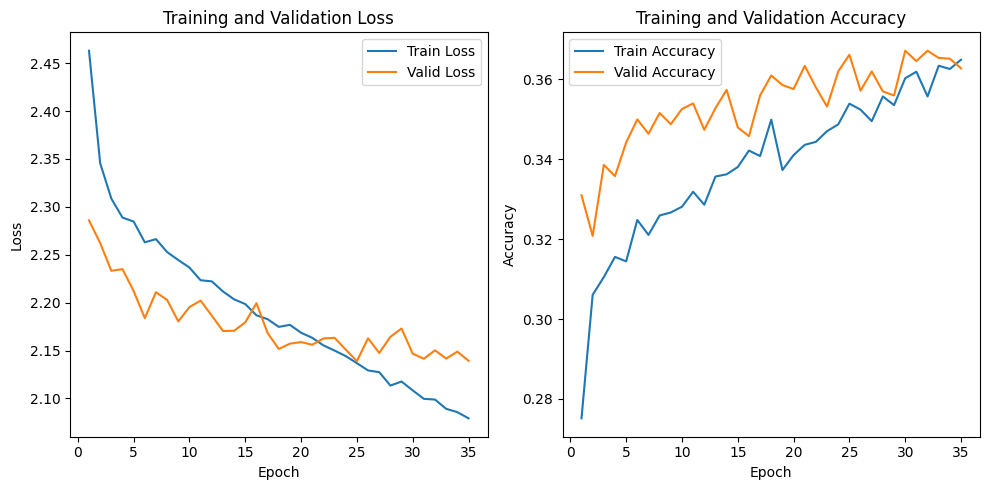
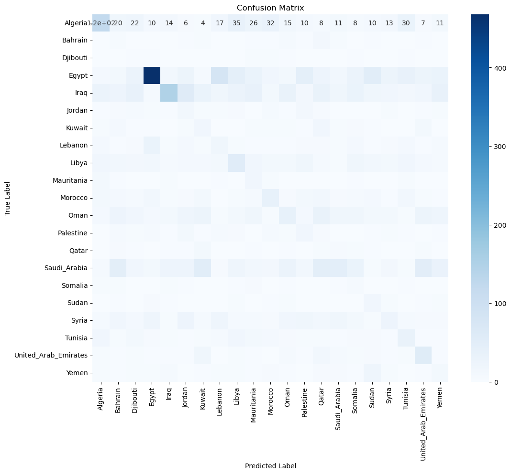

# Classification Model

**Table of Contents**
1. Objectives
2. Iterations
    - Release v0.0.2
    - Release v0.0.1
3. Conclusion

## 1. Objectives
Given some arabic text, the goal is to classify it into one of 21 labels:
- Egypt
- Iraq
- Saudi_Arabia
- Mauritania
- Algeria
- Syria
- Oman
- Tunisia
- Lebanon
- Morocco
- Djibouti
- United_Arab_Emirates
- Kuwait
- Libya
- Bahtain
- Qatar
- Yemen
- Palestine
- Jordan
- Somalia
- Sudan
  

Some countries don't have a lot of observations, which means that it might be harder to detect their dialects. We need to take this into consideration when training and evaluating the model (by assigning weights/oversampling, and by choosing appropriate evaluation metrics):  
  



## 2. Iterations
### Release v0.0.2
In the second release, I finetuned the langage model `https://huggingface.co/moussaKam/AraBART` by attaching to it a classification head and freezing the weights of the base model (due to compute constraints):
```
(classification_head): MBartClassificationHead(
    (dense): Linear(in_features=768, out_features=768, bias=True)
    (dropout): Dropout(p=0.0, inplace=False)
    (out_proj): Linear(in_features=768, out_features=21, bias=True)
)
```
The model was trained for 35 epochs, with the following optimizer:  
`optimizer = optim.Adam(model.parameters(), lr=0.0001)`  
  
It achieved the lowest loss on validation data at the 25th epoch, which is the checkpoint that was kept.  
We can probably achieve better results by training a model with more capacity for more epochs.  
  


**Accuracy achieved on test set: 0.3466**

### Release v0.0.1
For the first release, we will convert the tweets into vector embeddings using the AraBART model. We will extract those embeddings from the output of the last hidden layer of the AraBART model. After that, we will train a multinomial logistic regression using these embeddings as features.

We get the following results:

**Logistic Regression**
- Train set:  
    - Accuracy: 0.3448095238095238  
    - F1 macro average: 0.30283202516650803
    - F1 weighted average: 0.35980803167526537  
- Test set:
    - Accuracy: 0.2324
    - F1 macro average: 0.15894661492139023
    - F1 weighted average: 0.2680459740545796

We see that the model is struggling to correctly classify the different dialects, (which makes sense because everything is in arabic at the end of the day). Let's have a look at the confusion matrix.  
  


From the confusion matrix, we see that the model is only really able to detect Egyptian arabic, and to a lesser extent Iraqi and Algerian.

## 3. Conclusion

It is hard to classify the arabic dialects with a simple approach such as a multinomial logistic regression trained on top of those vector embeddings. One potential reason could be related to the limitations of the training dataset:  
Due to the way it was collected, it is labeling the text because of the location of the tweet, instead of the actual content of the text. As a result, it is possible that a lot of the tweets labeled as a dialect of a given country, contain in reality some text in Modern Standard Arabic, or in another dialect, or also possibly in a mix of dialects, which are all common ways in which arabic is used on social media.